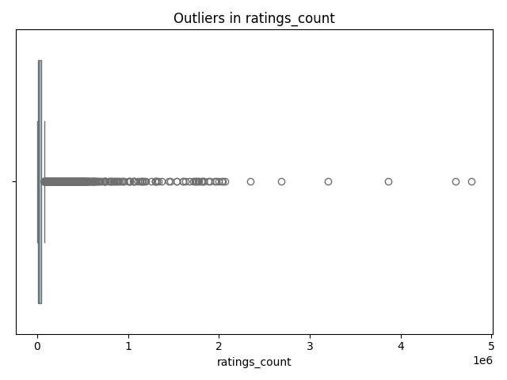
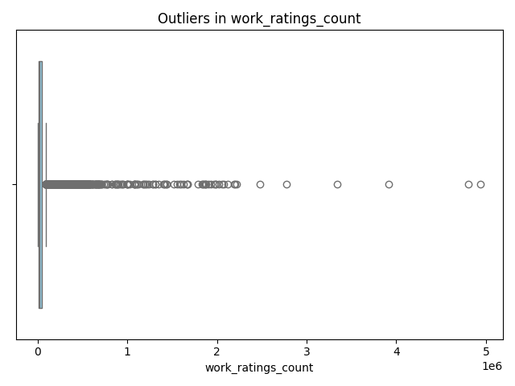
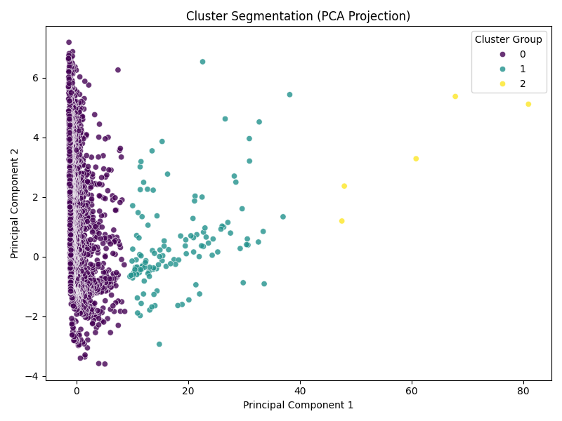
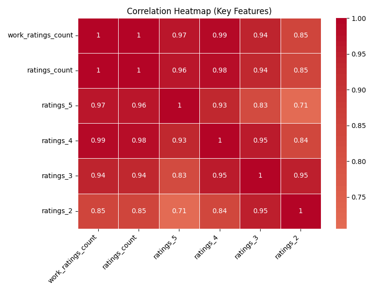
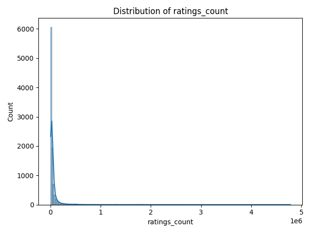
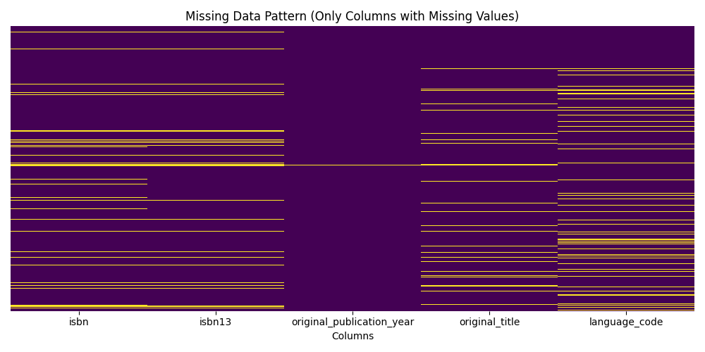
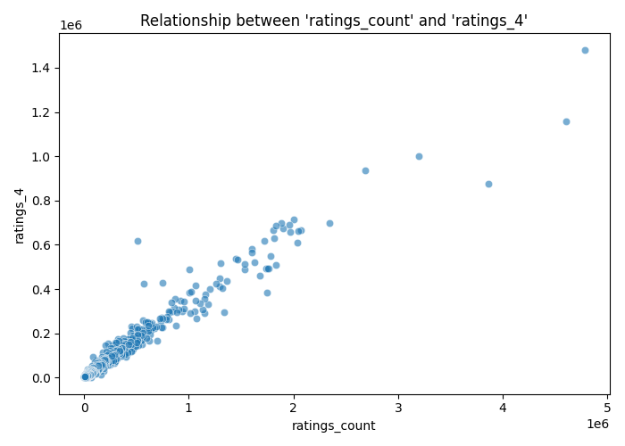

# Automated Data Analysis Report

# Automated Data Analysis Report
## 1. Dataset Overview
The dataset appears to be related to books, with 10,000 rows and 20 columns, including book identifiers, author information, publication details, ratings, and text reviews. The structure suggests a comprehensive collection of book metadata and user feedback.

## 2. Data Quality Assessment
The dataset exhibits some data quality issues, including missing values in the `isbn`, `isbn13`, `original_publication_year`, and `language_code` columns. The presence of 700 missing `isbn` values and 585 missing `isbn13` values may indicate inconsistent data entry or variability in book identification. Additionally, the `original_publication_year` column has 21 missing values, which could affect analysis of publication trends. The skewness in the `ratings_count` and `work_text_reviews_count` columns may also impact the accuracy of models relying on these features.

## 3. Key Patterns in Data
The distribution of `average_rating` values shows a mean of 4.00, indicating a generally positive reception of books. The `ratings_count` and `work_ratings_count` columns exhibit strong positive correlations, suggesting that books with more ratings tend to have more work-level ratings. The `work_text_reviews_count` column also correlates with `ratings_count`, implying that books with more ratings are more likely to have text reviews.

## 4. Feature Relationships
The strongest correlations exist between `goodreads_book_id`, `best_book_id`, and `work_id`, which is expected given their functional relationships in identifying books. The correlation between `ratings_count` and `work_ratings_count` (1.0) suggests that these features are highly interdependent, possibly due to the way ratings are aggregated. The correlation between `ratings_1` and `ratings_2` (0.93) may indicate that users who give low ratings tend to do so consistently.

## 5. Outlier Analysis
Outliers in the `book_id`, `goodreads_book_id`, and `best_book_id` columns may indicate data entry errors or unusual book identification cases. The presence of outliers in the `ratings_count` and `work_text_reviews_count` columns could represent extremely popular or highly debated books. For instance, a book with an unusually high `ratings_count` may be a bestseller or a controversial title.

## 6. Segmentation / Clustering Insights
The cluster distribution suggests that the majority of the data (9869 points) belongs to a single cluster, with two smaller clusters containing 126 and 5 points, respectively. The largest cluster may represent a typical or average book profile, while the smaller clusters could indicate niche or exceptional cases, such as highly specialized genres or extremely popular authors.

## 7. Key Insights
1. **Rating Patterns**: The strong correlation between `ratings_1` and `ratings_2` suggests that users who give low ratings tend to do so consistently, implying that these users may be more critical or have specific expectations. **Interpretation**: This pattern could indicate that users who give low ratings are more discerning. **Implication**: Understanding these users' preferences can help authors or publishers tailor their content to meet the expectations of this critical audience.
2. **Book Popularity**: The correlation between `ratings_count` and `work_text_reviews_count` implies that books with more ratings are more likely to have text reviews, indicating a relationship between popularity and user engagement. **Interpretation**: This relationship suggests that popular books encourage more discussion. **Implication**: Authors or publishers can leverage this insight to promote books with high ratings and encourage users to write reviews, potentially increasing the book's visibility.
3. **Data Quality Impact**: The missing `isbn` and `isbn13` values may affect the accuracy of book identification and analysis, particularly if these values are used as unique identifiers. **Interpretation**: Incomplete data can lead to biased or incorrect conclusions. **Implication**: Ensuring complete and consistent data entry for book identifiers is crucial for reliable analysis and decision-making.
4. **Cluster Analysis**: The presence of smaller clusters may indicate niche or exceptional cases, such as highly specialized genres or extremely popular authors. **Interpretation**: These clusters could represent opportunities for targeted marketing or content creation. **Implication**: Identifying and understanding these niche cases can help authors, publishers, or marketers develop tailored strategies to cater to specific audience interests.
5. **Rating Distribution**: The distribution of `average_rating` values shows a generally positive reception of books, with a mean of 4.00. **Interpretation**: This suggests that, overall, users tend to rate books favorably. **Implication**: This positive trend can be leveraged in marketing strategies to emphasize the high quality of books, potentially attracting more readers.
6. **Feature Interdependence**: The strong correlation between `ratings_count` and `work_ratings_count` suggests that these features are highly interdependent. **Interpretation**: This interdependence implies that ratings at different levels (book vs. work) are closely related. **Implication**: Understanding this relationship can help in developing models that predict ratings or identify factors influencing user ratings.

## 8. Strategic Implications
The insights from this analysis have several strategic implications:
- **Targeted Marketing**: Identifying niche clusters or understanding user rating patterns can help in developing targeted marketing strategies to appeal to specific audience segments.
- **Content Creation**: Recognizing the relationship between book popularity and user engagement can guide content creation efforts, focusing on books that are likely to encourage discussion and attract high ratings.
- **Data Quality Improvement**: Ensuring complete and consistent data entry for book identifiers is essential for reliable analysis and decision-making.
- **User Engagement**: Leveraging the positive trend in average ratings can help in marketing strategies, emphasizing the high quality of books to attract more readers.

## 9. Recommendations
Based on the analysis, the following steps are recommended:
- **Improve Data Quality**: Implement measures to ensure complete and consistent data entry for book identifiers.
- **Develop Targeted Marketing Strategies**: Use cluster analysis and rating patterns to develop targeted marketing campaigns.
- **Enhance Content Creation**: Focus on creating content that encourages discussion and attracts high ratings, based on the insights from the analysis.
- **Implement Advanced Analysis**: Consider factor analysis on rating columns and regression analysis on average rating to gain deeper insights into user behavior and preferences.

## Advanced LLM-Driven Analysis

### factor analysis on rating columns
Suggested advanced analysis. Can be implemented for deeper insights.

### regression analysis on average rating
Suggested advanced analysis. Can be implemented for deeper insights.

### Cluster Analysis
{0: 9869, 1: 126, 2: 5}

## Visualizations

### boxplot_ratings_count.png

### boxplot_work_ratings_count.png

### cluster_pca.png

### correlation_heatmap.png

### distribution_ratings_count.png

### distribution_work_ratings_count.png

### missing_heatmap.png

### scatter_ratings_count_vs_ratings_4.png

