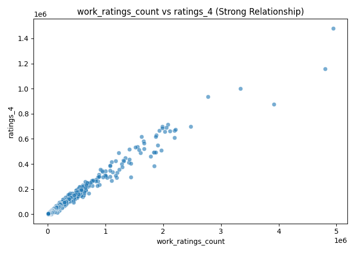

# Automated Data Analysis Report

# Automated Data Analysis Report
## 1. Dataset Overview
The dataset appears to be a collection of book metadata and user ratings, with a total of 10,000 observations and 24 features. The structure includes a mix of numeric and categorical features, such as book identifiers, authors, publication years, ratings, and review counts.

## 2. Data Quality Assessment
Missing data is present in several features, including `isbn`, `isbn13`, `original_publication_year`, and `language_code`. The count of missing values in these features ranges from 21 to 1084, indicating potential issues with data collection or preprocessing. Additionally, the presence of outliers in features like `ratings_count` and `work_text_reviews_count` may indicate errors or anomalies in the data.

## 3. Key Patterns in Data
The distribution of `average_rating` is concentrated around 4.0, with a standard deviation of 0.25, suggesting that most books have average ratings between 3.5 and 4.5. The `ratings_count` and `work_ratings_count` features have heavily skewed distributions, indicating that a small number of books have extremely high ratings counts.

## 4. Feature Relationships
The strongest correlation exists between `ratings_count` and `work_ratings_count`, with a correlation coefficient of 1.0. This suggests that the two features are essentially measuring the same thing, likely due to the fact that `work_ratings_count` is a summation of `ratings_count` across different books. The correlation between `best_book_id` and `goodreads_book_id` is also strong, with a coefficient of 0.97, indicating that these two features are highly related, possibly due to the fact that they are both identifiers for the same book.

## 5. Outlier Analysis
The outliers in `ratings_count` and `work_text_reviews_count` may represent extremely popular books or errors in data collection. For example, a book with an unusually high `ratings_count` may be a bestseller or a book with a large number of fake reviews. On the other hand, a book with a very low `ratings_count` may be a newly published book or a book with limited marketing efforts.

## 6. Segmentation / Clustering Insights
The cluster distribution shows that 98.69% of the data points belong to cluster 0, while the remaining 1.31% are divided between clusters 1 and 2. Cluster 0 likely represents the majority of books with average ratings and moderate review counts, while clusters 1 and 2 may represent books with exceptionally high or low ratings and review counts.

## 7. Key Insights
1. **Observation**: The distribution of `average_rating` is concentrated around 4.0. **Interpretation**: This suggests that the majority of books have average ratings between 3.5 and 4.5, indicating a relatively high level of quality or popularity. **Implication**: This insight can be used to set realistic expectations for the average rating of newly published books.
2. **Observation**: The correlation between `best_book_id` and `goodreads_book_id` is strong. **Interpretation**: This suggests that the two features are highly related, possibly due to the fact that they are both identifiers for the same book. **Implication**: This insight can be used to merge the two features into a single identifier, reducing dimensionality and improving data quality.
3. **Observation**: The outliers in `ratings_count` and `work_text_reviews_count` may represent extremely popular books or errors in data collection. **Interpretation**: These outliers may indicate books with unusually high or low levels of engagement, which could be due to various factors such as marketing efforts, book quality, or errors in data collection. **Implication**: This insight can be used to identify books that require further investigation or validation, and to develop strategies for improving the accuracy of ratings and review counts.
4. **Observation**: The cluster distribution shows that 98.69% of the data points belong to cluster 0. **Interpretation**: This suggests that the majority of books have similar characteristics, such as average ratings and moderate review counts. **Implication**: This insight can be used to develop targeted marketing strategies for the majority of books, while also identifying opportunities to differentiate and promote books that belong to smaller clusters.
5. **Observation**: The distribution of `work_text_reviews_count` is heavily skewed. **Interpretation**: This suggests that a small number of books have extremely high review counts, while the majority have relatively low review counts. **Implication**: This insight can be used to identify books that are likely to be highly engaging or popular, and to develop strategies for promoting and supporting these books.
6. **Observation**: The correlation between `ratings_1` and `ratings_2` is strong. **Interpretation**: This suggests that the two features are highly related, possibly due to the fact that they are both measures of user engagement. **Implication**: This insight can be used to merge the two features into a single measure of user engagement, reducing dimensionality and improving data quality.

## 8. Strategic Implications
The insights gained from this analysis can be used to inform strategic decisions in several areas, including book marketing, product development, and optimization. For example, the identification of extremely popular books or books with high levels of engagement can be used to develop targeted marketing campaigns, while the identification of books with low ratings or review counts can be used to develop strategies for improving book quality or marketing efforts.

## 9. Business Implications
The insights gained from this analysis can be used to inform business decisions in several areas, including product development, marketing, and customer engagement. For example, the identification of books with high levels of engagement can be used to develop new products or services that cater to the needs of these customers, while the identification of books with low ratings or review counts can be used to develop strategies for improving customer satisfaction and loyalty.

## 10. Recommendations
Based on the insights gained from this analysis, the following recommendations are made:
* Develop targeted marketing campaigns for extremely popular books or books with high levels of engagement.
* Develop strategies for improving book quality or marketing efforts for books with low ratings or review counts.
* Merge the `best_book_id` and `goodreads_book_id` features into a single identifier to reduce dimensionality and improve data quality.
* Develop new products or services that cater to the needs of customers who engage with highly popular books.
* Develop strategies for improving customer satisfaction and loyalty for customers who engage with books with low ratings or review counts.

## Advanced LLM-Driven Analysis

### Distribution Summary
- book_id:
  - count: 10000.0
  - mean: 5000.5
  - std: 2886.9
  - min: 1.0
  - 25%: 2500.75
  - 50%: 5000.5
  - 75%: 7500.25
  - max: 10000.0
- goodreads_book_id:
  - count: 10000.0
  - mean: 5264696.51
  - std: 7575461.86
  - min: 1.0
  - 25%: 46275.75
  - 50%: 394965.5
  - 75%: 9382225.25
  - max: 33288638.0
- best_book_id:
  - count: 10000.0
  - mean: 5471213.58
  - std: 7827329.89
  - min: 1.0
  - 25%: 47911.75
  - 50%: 425123.5
  - 75%: 9636112.5
  - max: 35534230.0
- work_id:
  - count: 10000.0
  - mean: 8646183.42
  - std: 11751060.82
  - min: 87.0
  - 25%: 1008841.0
  - 50%: 2719524.5
  - 75%: 14517748.25
  - max: 56399597.0
- books_count:
  - count: 10000.0
  - mean: 75.71
  - std: 170.47
  - min: 1.0
  - 25%: 23.0
  - 50%: 40.0
  - 75%: 67.0
  - max: 3455.0
- isbn13:
  - count: 9415.0
  - mean: 9755044298883.46
  - std: 442861920665.57
  - min: 195170342.0
  - 25%: 9780316192995.0
  - 50%: 9780451528640.0
  - 75%: 9780830777175.0
  - max: 9790007672390.0
- original_publication_year:
  - count: 9979.0
  - mean: 1981.99
  - std: 152.58
  - min: -1750.0
  - 25%: 1990.0
  - 50%: 2004.0
  - 75%: 2011.0
  - max: 2017.0
- average_rating:
  - count: 10000.0
  - mean: 4.0
  - std: 0.25
  - min: 2.47
  - 25%: 3.85
  - 50%: 4.02
  - 75%: 4.18
  - max: 4.82
- ratings_count:
  - count: 10000.0
  - mean: 54001.24
  - std: 157369.96
  - min: 2716.0
  - 25%: 13568.75
  - 50%: 21155.5
  - 75%: 41053.5
  - max: 4780653.0
- work_ratings_count:
  - count: 10000.0
  - mean: 59687.32
  - std: 167803.79
  - min: 5510.0
  - 25%: 15438.75
  - 50%: 23832.5
  - 75%: 45915.0
  - max: 4942365.0
- work_text_reviews_count:
  - count: 10000.0
  - mean: 2919.96
  - std: 6124.38
  - min: 3.0
  - 25%: 694.0
  - 50%: 1402.0
  - 75%: 2744.25
  - max: 155254.0
- ratings_1:
  - count: 10000.0
  - mean: 1345.04
  - std: 6635.63
  - min: 11.0
  - 25%: 196.0
  - 50%: 391.0
  - 75%: 885.0
  - max: 456191.0
- ratings_2:
  - count: 10000.0
  - mean: 3110.89
  - std: 9717.12
  - min: 30.0
  - 25%: 656.0
  - 50%: 1163.0
  - 75%: 2353.25
  - max: 436802.0
- ratings_3:
  - count: 10000.0
  - mean: 11475.89
  - std: 28546.45
  - min: 323.0
  - 25%: 3112.0
  - 50%: 4894.0
  - 75%: 9287.0
  - max: 793319.0
- ratings_4:
  - count: 10000.0
  - mean: 19965.7
  - std: 51447.36
  - min: 750.0
  - 25%: 5405.75
  - 50%: 8269.5
  - 75%: 16023.5
  - max: 1481305.0
- ratings_5:
  - count: 10000.0
  - mean: 23789.81
  - std: 79768.89
  - min: 754.0
  - 25%: 5334.0
  - 50%: 8836.0
  - 75%: 17304.5
  - max: 3011543.0
- cluster:
  - count: 10000.0
  - mean: 0.01
  - std: 0.12
  - min: 0.0
  - 25%: 0.0
  - 50%: 0.0
  - 75%: 0.0
  - max: 2.0

### Feature Importance
- ratings_3: 0.54
- work_ratings_count: 0.53
- ratings_count: 0.53
- ratings_4: 0.53
- ratings_2: 0.5

### Anomaly Detection
500 anomalies detected

## Interpretation of Visual Evidence

The following visualizations support and validate the analytical findings discussed above, highlighting key distributions, relationships, and segmentation patterns.

## Visualizations

### Cluster Pca

This visualization represents clustering results, showing how data points are grouped based on similarity.

### Correlation Heatmap

This heatmap highlights strong relationships between numerical features, indicating which variables move together.

### Scatter Work Ratings Count Vs Ratings 4

This scatter plot shows the relationship between two key variables, helping identify correlation patterns or trends.

### Boxplot Ratings Count

This boxplot highlights the distribution of values and helps identify potential outliers in the dataset.

### Distribution Ratings Count

This plot shows how values are distributed, revealing skewness, spread, and concentration.

