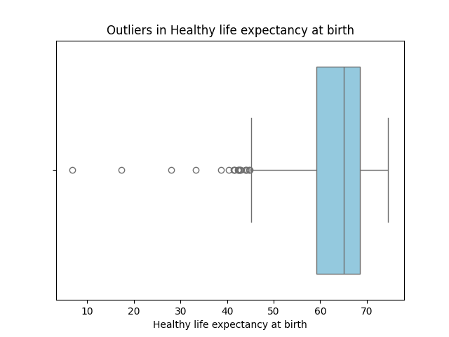
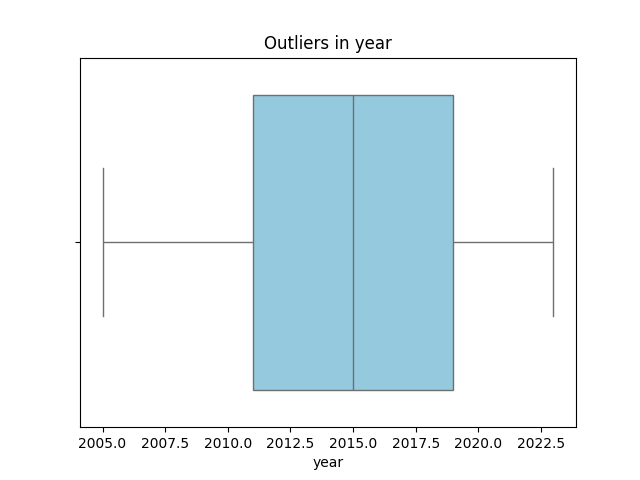
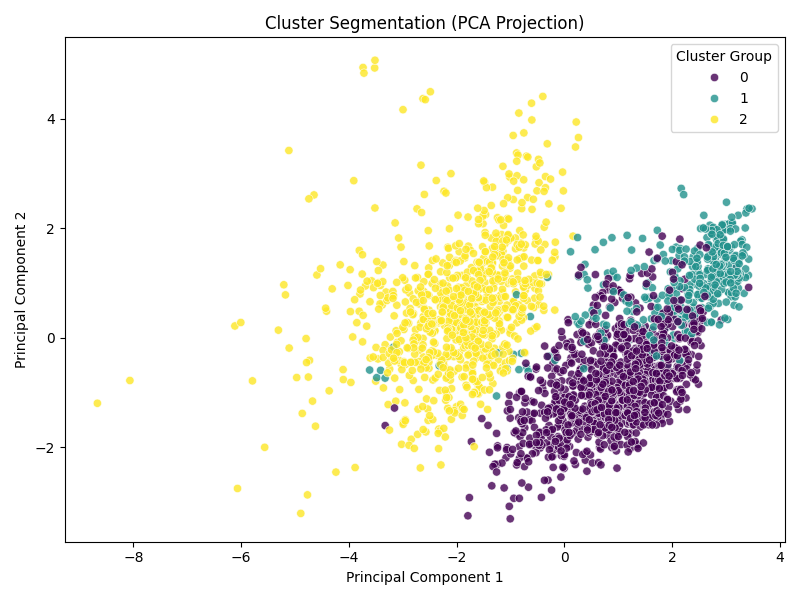
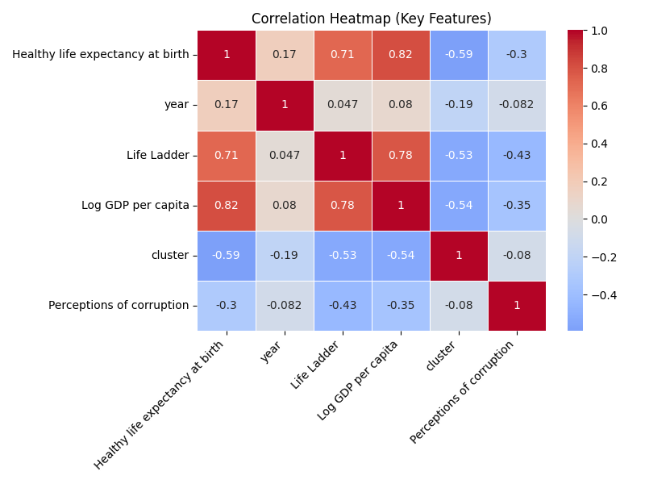
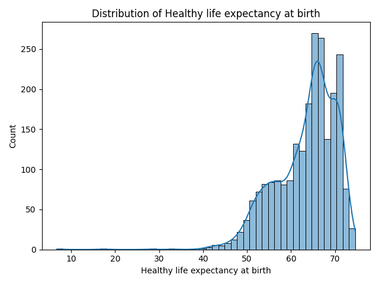
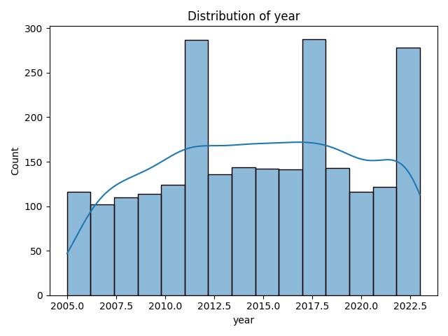
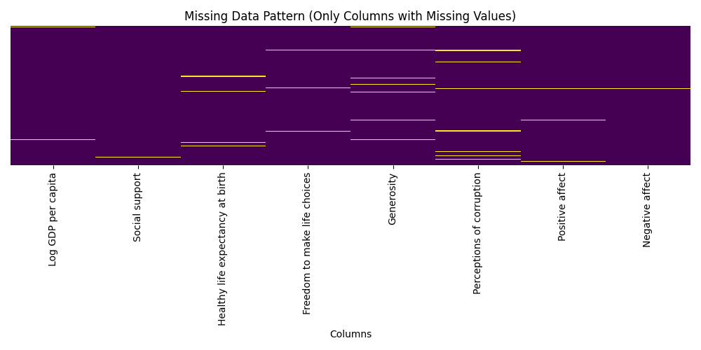
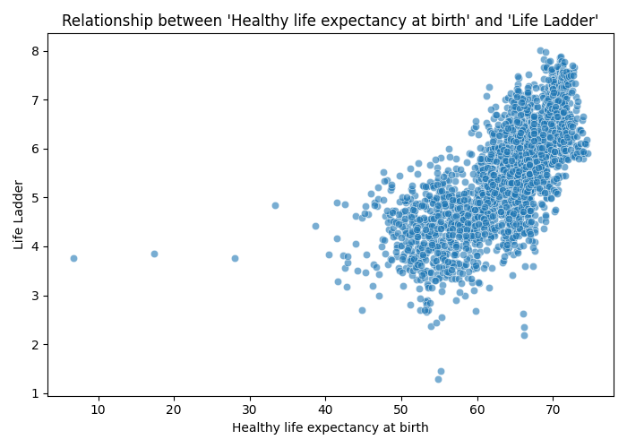

# Automated Data Analysis Report

# Automated Data Analysis Report
## 1. Dataset Overview
This dataset appears to be a collection of countries' well-being metrics, including economic, social, and health-related indicators, recorded over several years. The structure consists of 2363 rows, representing country-year observations, and 11 columns, capturing various aspects of national well-being, such as Life Ladder, Log GDP per capita, Social support, and Healthy life expectancy at birth.

## 2. Data Quality Assessment
The dataset has a moderate number of missing values, particularly in features like Log GDP per capita, Healthy life expectancy at birth, and Perceptions of corruption. The presence of 119 anomalies detected by Anomaly Detection analysis and 48 outliers in Social support suggests potential data inconsistencies or errors. Moreover, the skewness in certain features, such as the high variance in Healthy life expectancy at birth, may impact model performance and interpretation.

## 3. Key Patterns in Data
The distribution of Life Ladder scores suggests a relatively normal distribution, with most countries clustering around the mean score of 5.48. The high variance in Healthy life expectancy at birth indicates significant differences in healthcare outcomes across countries. The positive skewness in Log GDP per capita implies that many countries have relatively low GDP per capita, while a few have very high values.

## 4. Feature Relationships
The strongest correlation between Life Ladder and Log GDP per capita (0.78) suggests that economic prosperity is a key driver of national well-being. The correlation between Life Ladder and Social support (0.72) implies that social connections and community support also play a crucial role in determining national happiness. The relationship between Healthy life expectancy at birth and Log GDP per capita (0.82) indicates that access to quality healthcare is closely tied to economic development.

## 5. Outlier Analysis
The presence of outliers in Social support, such as the 48 extreme values, may indicate errors in data collection or rare events, such as countries with exceptionally strong or weak social support systems. The 20 outliers in Healthy life expectancy at birth could represent countries with unusually high or low life expectancies, potentially due to exceptional healthcare systems or extreme environmental factors.

## 6. Segmentation / Clustering Insights
The cluster distribution, with 1060 observations in cluster 0, 902 in cluster 2, and 401 in cluster 1, suggests that countries can be grouped into three broad categories based on their well-being profiles. Cluster 0 may represent countries with relatively high Life Ladder scores and strong social support, while cluster 2 may comprise countries with lower Life Ladder scores and weaker social support. Cluster 1 may consist of countries with unique characteristics, such as high Healthy life expectancy at birth, that set them apart from the other two clusters.

## 7. Key Insights
1. **Economic prosperity is a key driver of national well-being**: The strong correlation between Life Ladder and Log GDP per capita implies that increasing economic growth can lead to improved national happiness.
2. **Social support is crucial for national well-being**: The correlation between Life Ladder and Social support suggests that investing in social programs and community development can have a positive impact on national happiness.
3. **Access to quality healthcare is closely tied to economic development**: The relationship between Healthy life expectancy at birth and Log GDP per capita indicates that economic growth can lead to improved healthcare outcomes.
4. **Countries with high Life Ladder scores tend to have strong social support and high Healthy life expectancy at birth**: The cluster analysis suggests that countries with high overall well-being tend to have a combination of strong social support, high economic growth, and good healthcare outcomes.
5. **There are significant differences in healthcare outcomes across countries**: The high variance in Healthy life expectancy at birth implies that some countries have much better healthcare systems than others, presenting opportunities for knowledge sharing and improvement.
6. **Data quality issues may impact model performance and interpretation**: The presence of missing values, outliers, and anomalies suggests that data cleaning and preprocessing are essential for reliable insights and decision-making.

## 8. Strategic Implications
1. **Invest in economic growth and social programs**: Governments and organizations can focus on stimulating economic growth and developing social support systems to improve national well-being.
2. **Prioritize healthcare development**: Investing in healthcare infrastructure and access to quality healthcare can lead to improved national well-being and economic growth.
3. **Share knowledge and best practices**: Countries with high Life Ladder scores and strong social support can share their experiences and strategies with other countries to promote global well-being.
4. **Address data quality issues**: Ensuring high-quality data through rigorous collection, cleaning, and preprocessing is crucial for reliable insights and decision-making.

## 9. Recommendations
1. **Develop and implement data quality control measures**: Establish robust data collection and preprocessing procedures to minimize missing values, outliers, and anomalies.
2. **Conduct further analysis on cluster characteristics**: Investigate the unique features of each cluster to gain a deeper understanding of the factors driving national well-being.
3. **Explore the use of machine learning models**: Develop predictive models to identify the most important drivers of national well-being and forecast future trends.
4. **Design and implement targeted interventions**: Develop evidence-based policies and programs to address specific areas of improvement, such as healthcare development and social support.

## Advanced LLM-Driven Analysis

### Cluster Analysis
{0: 1060, 2: 902, 1: 401}

### partial dependence plots
Suggested advanced analysis. Can be implemented for deeper insights.

### Anomaly Detection
119 anomalies detected

## Visualizations

### Boxplot Healthy Life Expectancy At Birth

### Boxplot Year

### Cluster Pca

### Correlation Heatmap

### Distribution Healthy Life Expectancy At Birth

### Distribution Year

### Missing Heatmap

### Scatter Healthy Life Expectancy At Birth Vs Life Ladder

