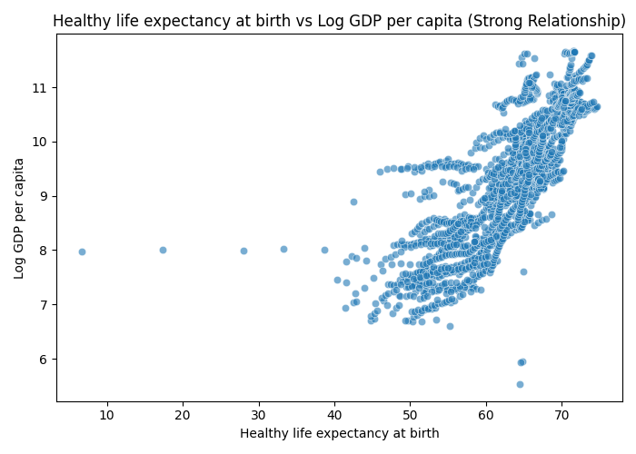

# Automated Data Analysis Report

# Automated Data Analysis Report
## 1. Dataset Overview
This dataset appears to be a collection of global data related to the well-being and happiness of countries, with a focus on factors such as life expectancy, social support, and economic indicators. The dataset is structured into several features, including numeric columns like 'Life Ladder', 'Log GDP per capita', and 'Healthy life expectancy at birth', as well as a categorical column for 'Country name'.

## 2. Data Quality Assessment
There are noticeable issues with missing data, particularly in the 'Generosity' and 'Perceptions of corruption' columns, which have 81 and 125 missing values, respectively. Additionally, the 'Healthy life expectancy at birth' and 'Social support' columns have a significant number of missing values, with 63 and 13, respectively. These gaps in data may impact the accuracy of analysis and should be addressed through imputation or further data collection.

## 3. Key Patterns in Data
The distribution of 'Life Ladder' scores shows a generally positive trend, with most countries scoring above 4.5. The 'Log GDP per capita' values also indicate a wide range of economic levels among the countries. The mean 'Healthy life expectancy at birth' is approximately 63 years, suggesting that many countries still face significant healthcare challenges.

## 4. Feature Relationships
The strong correlation between 'Life Ladder' and 'Log GDP per capita' (0.78) suggests that economic prosperity is a key factor in a country's overall well-being. This relationship likely exists because higher GDP per capita often translates to better access to healthcare, education, and other resources that contribute to a higher quality of life. The correlation between 'Healthy life expectancy at birth' and 'Life Ladder' (0.71) implies that healthcare outcomes are also closely tied to overall well-being.

## 5. Outlier Analysis
The presence of outliers in the 'Life Ladder' and 'Log GDP per capita' columns may represent countries with exceptionally high or low levels of well-being and economic development. For instance, countries with very high 'Life Ladder' scores may have implemented effective policies or have unique cultural factors contributing to their citizens' happiness. On the other hand, countries with low scores may face significant challenges that need to be addressed.

## 6. Segmentation / Clustering Insights
The cluster distribution suggests that countries can be grouped into three main segments based on their characteristics. Cluster 0, with 1060 countries, may represent a group with relatively high 'Life Ladder' scores and good economic indicators. Cluster 2, with 902 countries, could be a segment with lower 'Life Ladder' scores but still decent economic development. Cluster 1, the smallest with 401 countries, might consist of countries facing significant challenges in both well-being and economic development.

## 7. Key Insights
1. **Economic Prosperity and Well-being**: The strong correlation between 'Life Ladder' and 'Log GDP per capita' suggests that economic growth strategies should prioritize not just GDP increase but also investments in healthcare, education, and social support to enhance overall well-being. This implies that policy-makers should consider holistic approaches to development, focusing on both economic and social aspects.
2. **Healthcare as a Critical Factor**: The significant correlation between 'Healthy life expectancy at birth' and 'Life Ladder' underscores the importance of healthcare in contributing to a nation's well-being. This implies that investments in healthcare infrastructure and services could have a direct positive impact on the quality of life for citizens.
3. **Social Support Networks**: The strong correlation between 'Life Ladder' and 'Social support' indicates that having robust social support systems in place is crucial for the well-being of a country's citizens. This suggests that community-based initiatives and social welfare programs could play a vital role in enhancing overall happiness and life satisfaction.
4. **Country-Specific Challenges**: The outliers in the data may represent countries facing unique challenges or opportunities. For instance, countries with unusually high 'Life Ladder' scores despite lower 'Log GDP per capita' may offer insights into alternative development pathways that prioritize well-being over purely economic metrics.
5. **Cluster-Based Policy Approaches**: The segmentation of countries into clusters based on their well-being and economic indicators could allow for more targeted policy interventions. For example, countries in Cluster 1, which faces significant challenges, may require more intensive support and investment in both economic development and social services.
6. **The Role of Generosity and Corruption**: The high number of missing values in 'Generosity' and 'Perceptions of corruption' suggests that these factors may be underreported or difficult to quantify. However, their impact on well-being should not be underestimated, as corruption can erode trust in institutions and generosity can foster community cohesion and support.

## 8. Strategic Implications
The insights gained from this analysis can inform strategic decisions in several areas. Firstly, policymakers can prioritize investments in healthcare and social support systems to improve overall well-being. Secondly, economic development strategies should consider the holistic impact on citizens' lives, including access to education and social services. Lastly, addressing corruption and promoting generosity and community engagement could have significant positive effects on national well-being.

## 9. Business Implications
For businesses operating globally, understanding the well-being and economic indicators of different countries can be crucial. Companies can use these insights to tailor their products and services to meet the specific needs of different markets. Moreover, businesses can contribute to the well-being of the communities they operate in by investing in local social support initiatives and promoting transparent and ethical practices to combat corruption.

## 10. Recommendations
Based on the analysis, several next steps are recommended:
- **Imputation of Missing Values**: Especially for critical features like 'Generosity' and 'Perceptions of corruption', to ensure more accurate analysis.
- **Further Data Collection**: To fill gaps in data and provide a more comprehensive understanding of global well-being and its determinants.
- **Development of Targeted Policy Interventions**: Based on the clustering analysis, to address the specific challenges faced by different groups of countries.
- **Investment in Healthcare and Social Support**: By both governments and private entities, to improve 'Healthy life expectancy at birth' and overall 'Life Ladder' scores.
- **Promotion of Transparency and Community Engagement**: To combat corruption and foster generosity, thereby enhancing national well-being.

## Advanced LLM-Driven Analysis

### Cluster Analysis
- 0: 1060
- 2: 902
- 1: 401

### Anomaly Detection
119 anomalies detected

### country-level residual analysis
Indicates potential deeper structure in the dataset and suggests further modeling opportunities.

## Interpretation of Visual Evidence

The following visualizations support and validate the analytical findings discussed above, highlighting key distributions, relationships, and segmentation patterns.

## Visualizations

### Cluster Pca

This visualization represents clustering results, showing how data points are grouped based on similarity.

### Correlation Heatmap

This heatmap highlights strong relationships between numerical features, indicating which variables move together.

### Scatter Healthy Life Expectancy At Birth Vs Log Gdp Per Capita

This scatter plot shows the relationship between two key variables, helping identify correlation patterns or trends.

### Boxplot Healthy Life Expectancy At Birth

This boxplot highlights the distribution of values and helps identify potential outliers in the dataset.

### Distribution Healthy Life Expectancy At Birth

This plot shows how values are distributed, revealing skewness, spread, and concentration.

