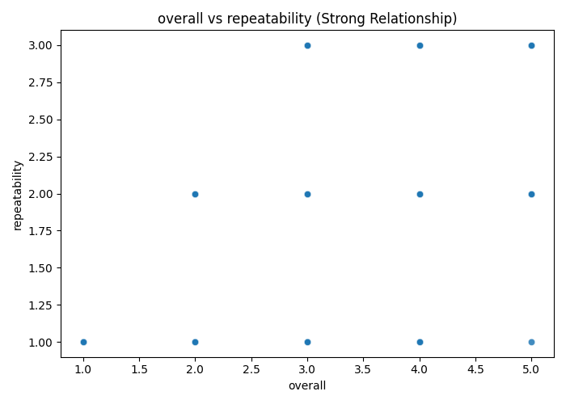

# Automated Data Analysis Report

# Automated Data Analysis Report
## 1. Dataset Overview
This dataset appears to be a collection of user reviews or ratings, with 2652 entries across various features such as date, language, type, title, and author, along with numerical ratings for overall quality, repeatability, and a specific 'quality' metric. The structure suggests a focus on evaluating the performance or appeal of certain items, events, or products, with the 'by' field indicating the source or author of the review.

## 2. Data Quality Assessment
A significant issue with this dataset is the presence of missing values, particularly in the 'date' and 'by' fields, which could hinder time-series analysis and author-specific evaluations, respectively. The absence of values in these fields might be due to incomplete data collection or privacy concerns, suggesting a need for either data imputation or collection strategy improvements.

## 3. Key Patterns in Data
The distribution of ratings, such as 'overall' and 'quality', shows a skew towards higher values, indicating a generally positive perception of the items or events being rated. However, the 'repeatability' metric has a lower mean and variance, suggesting that while the items may be of high quality, their repeatability or consistency is a concern, which could imply a need for improvement in this aspect to enhance user satisfaction or loyalty.

## 4. Feature Relationships
The strong correlation between 'overall' and 'quality' ratings suggests that users base their overall satisfaction significantly on the perceived quality of the item or event. This correlation likely exists because quality is a fundamental aspect of user experience, directly influencing overall satisfaction. Understanding and enhancing quality could therefore be critical for improving overall user ratings and experience.

## 5. Outlier Analysis
The presence of outliers, particularly in the 'overall' and 'quality' ratings, may represent exceptional cases where the item or event significantly exceeded or fell short of expectations. These outliers could indicate rare events, errors in data collection, or exceptionally high or low-quality items, and examining them could reveal insights into what drives extreme user satisfaction or dissatisfaction.

## 6. Segmentation / Clustering Insights
The clustering distribution, with three clusters of differing sizes, likely represents different segments of users or items with unique characteristics or preferences. For example, one cluster might comprise users who prioritize quality, while another might focus on repeatability. Each cluster likely represents a distinct market segment or user behavior pattern, understanding which could enable targeted marketing or product development strategies.

## 7. Key Insights
1. **Segmented User Preferences**: Observation of the cluster distribution reveals distinct user segments with potentially different preferences and priorities. Interpretation of this suggests that a one-size-fits-all approach may not be effective, and instead, tailored strategies could improve user satisfaction. Implication: Developing products or services that cater to these specific user segments could enhance market penetration and user loyalty.
2. **Quality as a Key Driver**: The strong correlation between 'overall' and 'quality' ratings indicates that quality is a significant driver of user satisfaction. Interpretation of this correlation suggests that investments in quality improvement could have a direct and positive impact on overall user experience. Implication: Focusing on enhancing the quality of items or events could be a strategic decision to increase overall user ratings and satisfaction.
3. **Repeatability as a Bottleneck**: Observation of the lower mean and variance in 'repeatability' ratings compared to 'overall' and 'quality' suggests that while items may be of high quality, their consistency is a concern. Interpretation of this pattern implies that improving repeatability could be a critical factor in enhancing user experience and satisfaction. Implication: Identifying and addressing the factors that affect repeatability could provide a competitive edge by offering consistent quality, thereby increasing user loyalty.
4. **Anomaly Detection for Insight**: The detection of anomalies in the data may represent rare events or outliers that can provide valuable insights into user behavior or preferences. Interpretation of these anomalies could reveal what drives extreme satisfaction or dissatisfaction. Implication: Analyzing these anomalies could inform the development of new products or services that cater to the needs of users who experience these extreme outcomes.
5. **Data Completeness and Privacy**: The presence of missing values, particularly in the 'date' and 'by' fields, indicates potential issues with data collection or privacy concerns. Interpretation of this issue suggests a need for a more robust data collection strategy that balances privacy with the need for comprehensive data. Implication: Implementing a more effective and privacy-conscious data collection approach could enhance the reliability and usability of the dataset for analysis and decision-making.
6. **Partial Dependence for Deeper Insights**: The indication of a potential deeper structure in the dataset from partial dependence plots suggests that there are more nuanced relationships between variables that could be explored. Interpretation of this implies that further analysis, potentially involving more advanced statistical or machine learning techniques, could uncover hidden patterns or interactions that are not immediately apparent. Implication: Investing in deeper analytical techniques could provide insights that could significantly inform product development, marketing strategies, or user experience enhancements.

## 8. Strategic Implications
Based on the insights derived from the analysis, strategic decisions could include focusing on quality enhancement, improving repeatability, and developing targeted marketing or product development strategies based on user segments. These decisions could lead to enhanced user satisfaction, increased loyalty, and ultimately, improved market performance.

## 9. Business Implications
The business implications of these insights involve recognizing the importance of quality and repeatability in driving user satisfaction and loyalty. This could lead to decisions such as investing in quality control measures, developing strategies to improve product or service consistency, and tailoring marketing efforts to appeal to distinct user segments.

## 10. Recommendations
Recommendations for next steps include conducting more in-depth analysis of user segments and preferences, implementing data imputation or collection strategies to address missing values, and exploring advanced analytical techniques such as machine learning models to uncover deeper insights into user behavior and preferences. Additionally, prioritizing quality and repeatability improvements based on the strategic implications and business decisions derived from the analysis could be crucial for enhancing overall user experience and satisfaction.

## Advanced LLM-Driven Analysis

### Cluster Analysis
- 0: 1315
- 2: 769
- 1: 568

### partial dependence plots
Indicates potential deeper structure in the dataset and suggests further modeling opportunities.

### Anomaly Detection
132 anomalies detected

## Interpretation of Visual Evidence

The following visualizations support and validate the analytical findings discussed above, highlighting key distributions, relationships, and segmentation patterns.

## Visualizations

### Cluster Pca

This visualization represents clustering results, showing how data points are grouped based on similarity.

### Correlation Heatmap

This heatmap highlights strong relationships between numerical features, indicating which variables move together.

### Scatter Overall Vs Repeatability

This scatter plot shows the relationship between two key variables, helping identify correlation patterns or trends.

### Boxplot Cluster

This visualization represents clustering results, showing how data points are grouped based on similarity.

### Distribution Cluster

This visualization represents clustering results, showing how data points are grouped based on similarity.

### Categorical From Numeric Quality

This chart shows frequency distribution of categorical variables, helping understand dominant categories.

