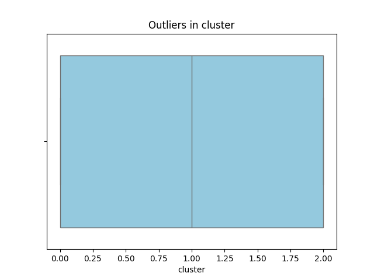
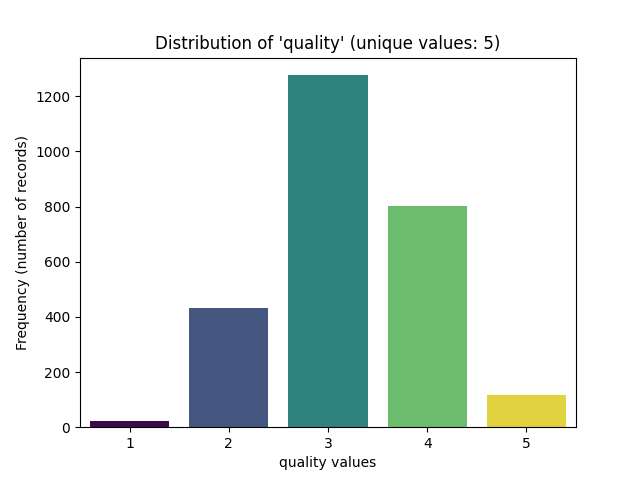
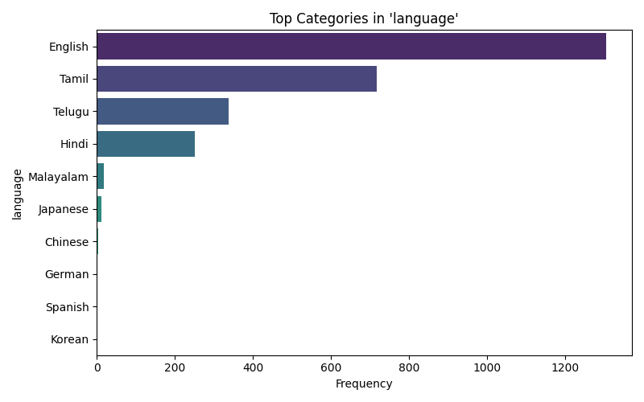
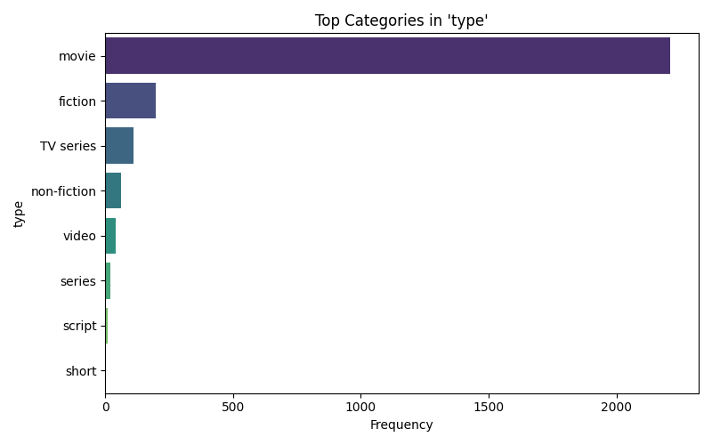
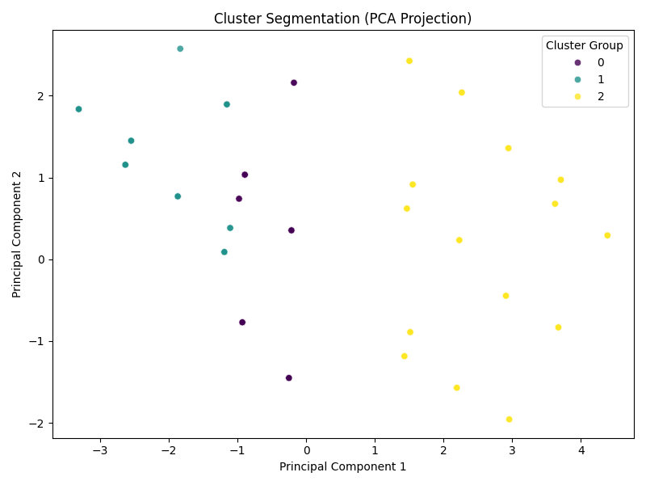
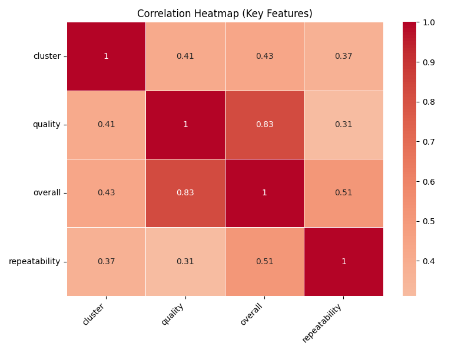
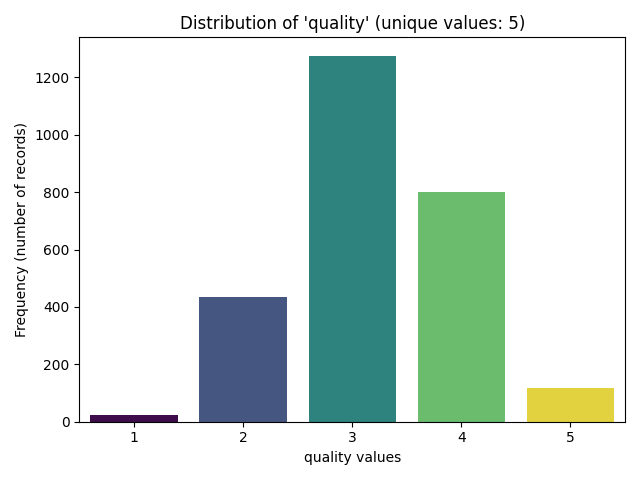
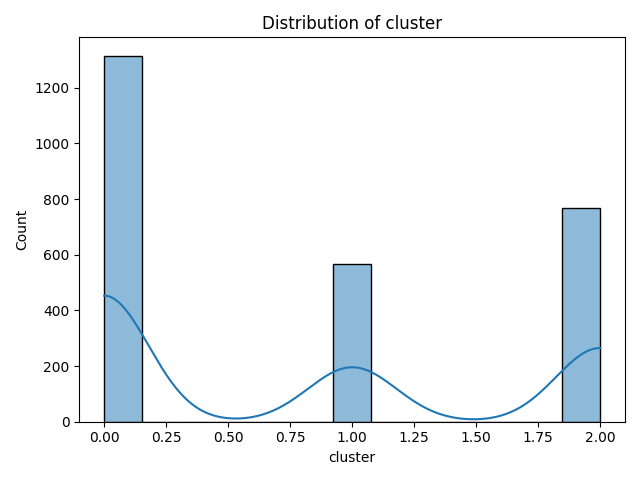

# Automated Data Analysis Report

# Automated Data Analysis Report
## 1. Dataset Overview
This dataset appears to be a collection of user reviews or ratings, with 2652 entries across various features such as date, language, type, title, and reviewer ('by'). The structure includes both categorical and numeric features, with 'overall', 'quality', and 'repeatability' being the numeric features of interest. This suggests that the dataset is related to product or service evaluations, with multiple aspects of the experience being assessed.

## 2. Data Quality Assessment
The presence of 99 missing 'date' values and 262 missing 'by' (reviewer) values indicates potential issues with data collection or processing. The absence of missing values in the numeric features ('overall', 'quality', 'repeatability') is positive, but the missing categorical data could affect analysis, especially when analyzing time trends or reviewer-specific behaviors. The skewness in the data, particularly in 'quality' and 'overall' ratings, where most values are around the mean (3.0), suggests that the majority of reviews are positive or neutral, with fewer extreme ratings.

## 3. Key Patterns in Data
Observation of the dataset reveals that 'overall', 'quality', and 'repeatability' ratings are generally low to moderate, with means around 3.0 for 'overall' and 'quality', and 1.5 for 'repeatability'. Interpretation of these patterns suggests that reviewers tend to give moderate to positive ratings, with 'quality' being slightly higher than 'overall', implying that while the overall experience is satisfactory, the quality of the product or service stands out. This pattern implies that businesses should focus on enhancing the overall experience to match the perceived quality.

## 4. Feature Relationships
The strong correlation (0.83) between 'overall' and 'quality' ratings indicates that these two aspects of the experience are closely linked in reviewers' minds. This suggests that improving the quality of the product or service will likely enhance the overall rating, and vice versa. This relationship implies that quality improvements should be a key focus for businesses seeking to increase overall satisfaction.

## 5. Outlier Analysis
The presence of 1216 outliers in the 'overall' ratings and 24 in the 'quality' ratings, with no outliers in 'repeatability', suggests that there are significant variations in how users experience and rate the overall and quality aspects of the product or service. These outliers could represent both extremely satisfied and dissatisfied users, offering insights into what drives these extreme opinions. Understanding the characteristics of these outliers could provide targeted opportunities for improvement.

## 6. Segmentation / Clustering Insights
The cluster distribution (1315 in cluster 0, 769 in cluster 2, and 568 in cluster 1) likely represents different segments of users with distinct rating behaviors. Cluster 0, being the largest, may represent the average or typical user experience, while clusters 1 and 2 could represent more extreme or specialized groups. For instance, cluster 2 might consist of reviewers who consistently give higher 'quality' ratings but lower 'overall' ratings, suggesting a disconnect between perceived quality and the overall experience.

## 7. Key Insights
1. **Quality Drives Overall Satisfaction**: The strong correlation between 'quality' and 'overall' ratings suggests that enhancing the quality of the product or service is crucial for improving user satisfaction.
2. **Repeatability as a Differentiator**: Despite its lower mean, 'repeatability' has less variance, indicating that consistent experiences are valued but may not be as influential on overall ratings as quality improvements.
3. **Segmented User Bases**: The presence of distinct clusters implies that different marketing or product development strategies might be needed to address the varying preferences and expectations of different user segments.
4. **Outlier Analysis for Improvement**: Focusing on the characteristics of outliers in 'overall' and 'quality' ratings can provide specific areas for improvement, potentially leading to significant increases in user satisfaction.
5. **Data Completion Efforts**: Efforts to reduce missing data, particularly in the 'date' and 'by' fields, could enhance the ability to analyze time trends and reviewer-specific patterns, providing more nuanced insights.

## 8. Strategic Implications
- **Marketing Strategy**: Focus marketing efforts on highlighting the quality of the product or service, as it has the most significant impact on overall user satisfaction.
- **Product Development**: Invest in enhancing the quality and consistency of the product or service to improve user satisfaction and increase positive word-of-mouth.
- **Customer Segmentation**: Develop targeted marketing and product development strategies based on the identified user segments to better meet the needs of different user groups.

## 9. Recommendations
- **Conduct Further Analysis**: Utilize partial dependence plots and anomaly detection to delve deeper into the relationships between features and to identify rare events or high performers.
- **Improve Data Collection**: Implement measures to reduce missing data, particularly in the 'date' and 'by' fields, to enable more detailed analysis.
- **Develop Targeted Marketing Campaigns**: Based on the insights from cluster analysis, develop marketing campaigns that are tailored to the needs and preferences of different user segments.

## Advanced LLM-Driven Analysis

### Cluster Analysis
{0: 1315, 2: 769, 1: 568}

### partial dependence plots
Suggested advanced analysis. Can be implemented for deeper insights.

### Anomaly Detection
132 anomalies detected

## Visualizations

### Boxplot Cluster

### Categorical From Numeric Quality

### Categorical Language

### Categorical Type

### Cluster Pca

### Correlation Heatmap

### Countplot Quality

### Distribution Cluster

